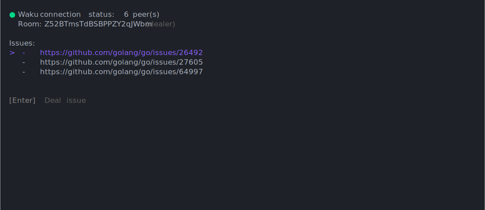

[](https://dl.circleci.com/status-badge/redirect/circleci/Y2kLo8L9kXZuvx3BjnwECN/CdjQighQjTLBLQrie3Rokz/tree/main) [](https://codeclimate.com/github/six78/2-story-points-cli/maintainability) [](https://codeclimate.com/github/six78/2-story-points-cli/test_coverage)

# Lock, Stock and Two Story Points

♦️️ Decentralized \
♠️ Poker Planning \
♥️ Console Application

<p align="center">
  
</p>

[//]: # (Fancy a web version? -> https://six78.github.io/2-story-points )

# Description

- This is a CLI app for poker planning
- We use [Waku](https://waku.org) for players communication
- Messages are end-to-end encrypted, the key is shared elsewhere as part of the room id

[//]: # (# Get it)

# Build it your own
 ```shell
 git clone https://github.io/six78/2-story-points-cli
 cd 2-story-points
 go build
 ./2sp
 ```
 
Or just run the code with a shadow build:

```shell
go run main.go
```

Now share your room id with friends and start estimating your issues!